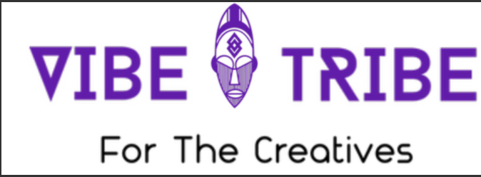

Welcome to my Code Insitute Milestone 1 (MS1) project.

# What is my project about ?

For my MS1 project I had to build a website that provides the user with information. I decided to create a webiste for a streetculture hub for creatives. Vibe Tribe is a hub for creatives to get together and collaborate as a collective to produce something wonderful as this is the essence of streetculture. The name Vibe Tribe was chosen for this project as "vibe" is used to define the atmoshphere of a space. In urban slang "vibe" is often used to described somthing that is chilled, peaceful or someone who is great to be around. Whilst the word "Tribe" is most commonly used to refer to a social division of people within society linked by blood ties. However, it can also be used to refer to people who share cultural and/or social links. The latter is the defintion being used in this case. As all users of this hub will indetifiy as creatives and will influence and/or be influnced by streetculture in some way.

# What inspired the Project ?

 The inspiration for this imaginary hub was the pandemic. There was as surge of creativity and togetherness which allowed people from various fields come together to solve problems, to challenge injustice & create amazing things in a way that has never happened before. It would be shame to loose that as thing slowly return to normal. Vibe Tribe is a means of maintaing that and ecouraging people to come togther and flourish, focusing on there common goals and intrests as opposed to their differences.

# User Experience Design (UX)

  ## Design

   ### Colour Scheme:
   ### Typography:
   ### Images & Videos:
   ###  Wireframes:

# Limitations 

# Testing 

# Technologies 

# Credits 
