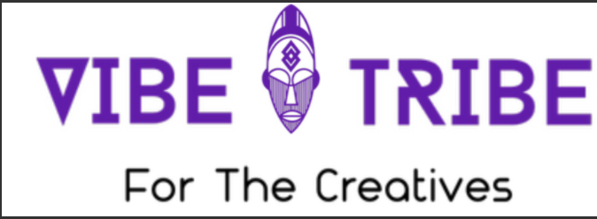
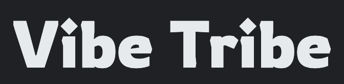
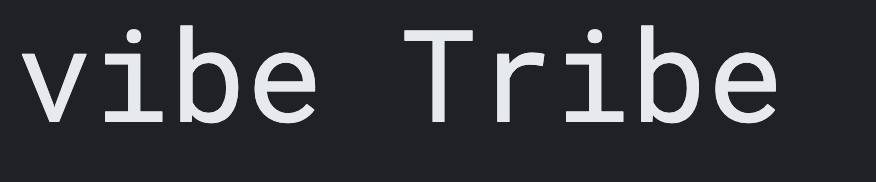
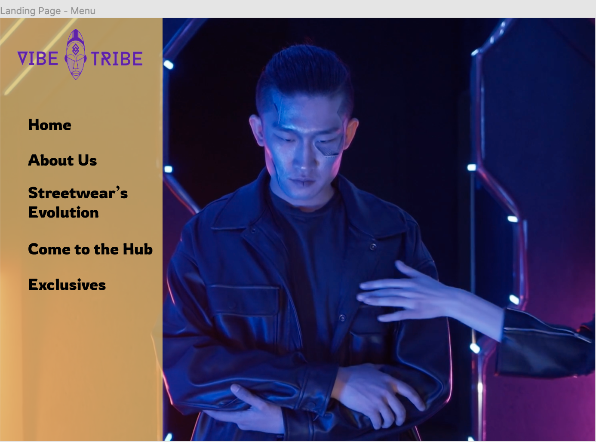

# What is my project about :question:

 I decided to create a webiste for a ficticious streetculture hub for creatives. Vibe Tribe is a hub for creatives to get together and collaborate as a collective to produce something wonderful as this is the essence of streetculture. The name Vibe Tribe was chosen for this project as "vibe" is used to define the atmoshphere of a space. In urban slang "vibe" is often used to described somthing that is chilled, peaceful or someone who is great to be around. Whilst the word "Tribe" is most commonly used to refer to a social division of people within society linked by blood ties. However, it can also be used to refer to people who share cultural and/or social links. The latter is the defintion being used in this case. As all users of this hub will indetifiy as creatives and will influence and/or be influnced by streetculture in some way.

# What inspired the Project ? :bulb:

 The inspiration for this imaginary hub was the pandemic. There was as surge of creativity and togetherness which allowed people from various fields come together to solve problems, to challenge injustice & create amazing things in a way that has never happened before. It would be shame to loose that as thing slowly return to normal. Vibe Tribe is a means of maintaing that and ecouraging people to come togther and flourish, focusing on there common goals and intrests as opposed to their differences. It also serves as way to educate people about the contribution streetculture and it sub cutlures have made to larger society.

# Table of contents :bookmark_tabs:
  [User Experience (UX)](#User-Experience-(UX)-art)

  [Current Features](#Current-features)

  [Testing](#Testing) 

  [Technologies Used](#Technologies-Used)
  
  [Credits](#Credits)

# User Experience (UX) :art:

  ## User Stories 

### Goals of a first time visitor :dart:

  • The visitor would want the purpose of the site to be clear and information should be easy to find.

  • The visitor would want the site to be easy to navigate on all devices.

  • The visitor would want the social media buttons to be easily accessible.

### Goals of a returning visitor :dart:

  • The visitor would be looking to find out more about street culture and be able to explore their interests more. 
  • The visitor would be looking to find out more informaton about the hub
  • The visitor would would to feel like their niche is being recognised
  
### Goals of a frequent visitor :dart:
  • The visitor would want to sign up to get exclusive content and updates

  • The visitor would want to know what activities are scheduled for a specific day

  • The visitor would want to be able to navigate their way to speific content easily.

  ## Design

   ### Colour Scheme
   
   The main goal of this webiste is to provide a space for creatives to learn more about street culture, So I wanted to pick a colour scheme that linked to that. Purple and Gold are the colours for Lakers a popular basketball team in the NBA and alot of there appereal is popular within street culture. 
   
   Purple is also said to symbolise creativty and transformation. This is what the enregy that I want the users to channel and associate with the hub. Gold is associated with luxury and widsdom. The site serves to educate those looking to learn more about street culture but also highlight the culture which has been devloped by creatives and its transiiton from urban to luxury spaces.
   
   Below is the colour palette that I created, based on the message I wanted my colours to convey. I then used [cava's colour palette generator](https://www.canva.com/colors/color-palette-generator/) to make sure that the colours I had chosen worked with the site content. Where more contrast was needed between colours I have used black or white.

   (Media/colour-palette.png)

   ### Typography

   The font used for the headers, footers and buttons is a latin display typeface called 'Rowdies'. I have chosen this font as it is bold and creative, inline with the sites theme. 

    

   The font used for the body text is a 'Work Sans', a typeface family based loosely on early Grotesques. It has simple features making it optimised for screen resolutions and easy for the user to read.

   
   
   ### Media :film_strip:
   I wanted the media used on my site to be a reflection of the creativity and intrests of the users. I was unable to create my own content so I used royalty free images and videos.

   • My videos were from [Pexels](https://www.pexels.com/).
   • I used pictures from [Pexels](https://www.pexels.com/) and [unsplash](https://unsplash.com/).

   ###  Mockup
   I used figma to create my mockups and have included the links to the mobile and desktop mockups. There are a few differnces in my mockup and the end product, so I have included  screenshots specific to those changes and the links to my mobile and desktop mockups are below:point_down:

   ### Desktop :desktop_computer:
   Intially I wanted to have a Hamburger side Menu as shown in the screen shots below. Later on I decided to use a navbar as this would be easy to navigate and would not draw attention away from the landing page video.
   
   I also changed the timeline to flip cards as I felt that this was more interactive and creative. :point_down:

    
    

   
   ### Mobile :iphone:

   To keep things as uniformed as possible I also chnaged the mobile menu to the nav bar and instead of flipcards I used hyperlinked pictures as a way to get more information on each niche. To view the mock ups please use the links :point_down:

   [Mobile mockup](https://www.figma.com/file/sIg0LyQzM1Mp1HuRNO1qo6/Vibe-Tribe---mobile?node-id=0%3A1) :arrow_left:

   [Desktop mockups](https://www.figma.com/file/BbJR4T8QcH8Eg2WflvtA8f/Vibe-tribe-desktop?node-id=0%3A1) :arrow_left:

# Current Features

   ### Header 

   • The header is the same across all pages and view port sizes, it contains the navigation bar with the active page being highlighted in purple so that   it is easier for user to navigate. On hover the page buttons turn purple as well. On smaller viewports the navigation bar displays vertically instead of horizontally.

   ### Logo 

   • The logo is visibile on every page irresspective of viewport size. 

   ### Accessibility

   • All media used has a description incase the link breaks. 
      
   • So that links are obvious to all users I have changed the defult active link and on hover link colours as the defult colours did not create enough contrast with the site colours.

   ### Responsiveness

   • All pages are responsive up until 320px

   ### Footer

   • The footer is the same across all pages and viewports to keep it uniformed. This makes it easier to navigate the site as the user knows what to expect. The   social media icons are in the footer so that they are present on every page. I decided to make the footer black so that it was obvious to the reader and then made it transparent so that it did not detract from the nav bar.

## Page Specific Features :memo:

   ### Landing Page

   • I used a video background for the landing page on larger viewports this is muted and on autoloop. I did this as I felt it gave the user a feel for what the site is about. The chosen video captivates the Creative expression of street culture. For smaller viewports I have used an image which also provides the same message.

   ### Streetwears Evolution

   • To display the informtation I used flip cards on larger viewports. I felt this was a creative way for the user to engage with the site. 

   • I used clickable images on smaller viewports that take you to the information relevant to each image. 

   ### Come To The Hub

   • I styled the table header to purple and on hover the rows turn gold. This was so that there was consisten creative flare across the site. I wanted the user to feel as though every detail of their experience was important.

   ### Exclusives

   • I have created a signup form with validation so that user is prompted if there is any error in completing the form.

   • I then linked the form to the code institute form dump so that the all user actions throughout the website generates a response. 

# Future Features :rocket: 

   • Add a review section, to make it easier to collect and implent user feedback.

   • Allow users to share their own stories on how they have contributed to streetwears evolution and/or have been impacted by it.

   • Use other programming languages to make the site more interactive and allow me to keep the same features across all vieports. I.e flipcards on smaller viewports is not possible with pure CSS.

   • Some images were not suitable for smaller viewports, so are not displayed. I would like to create/find similar images that is suitable for smaller screens, so that there is more consistency in the design across all veiw port sizes.
   
# Testing 

 ### Goals of a first time visitor 

  1. The visitor would want the purpose of the site to be clear and information should be easy to find. :white_check_mark:

      • The tagline of the logo is "for creatives" indicatimg to the visitor that this site is intended for creatives.

      • The landing page video also adds to the creative street culture vibe.

      • The navarbar is easily assecible in the header and gives the visitor the option to click the about us page where they can find more detailed information. 

  2. The visitor would want the site to be easy to navigate on all devices. :white_check_mark:

      • All page links are directly acessible in the navigation bar. The navigation bar is present in the header of every page keeping consistency throughout the site so it is easy for the visitor to intuitively browse through the website.

      • All pages are responsive until 320px.

  3. The visitor would want the social media buttons to be easily accessible. :white_check_mark:

      • The social media icons are present in the footer on every page.

      • The links take you to the correct page

      • The icons are clearly visible in the footer

### Goals of a returning visitor

  1. The visitor would be looking to find out more about street culture and be able to explore their interests more. :white_check_mark:

      • The flip cards (larger screens) and clickable images (smaller screens) give the user the freedom to only explore the topics they are intrested in.

      • if the reader wishes to find out more they can click the link that takes them to a page with further reading and links specific to the content dicussed. 

  2. The visitor would be looking to find out more informaton about the hub :white_check_mark:

      • There is a button in the nav bar specific to the hubs details, this is avaible on every page.

  3. The visitor would want to feel like their niche is being recognised :white_check_mark:

      • The hub gives all creatives the chnaces to celebrate their niche with a space each day to do their own thing or the option to participate in a different activity each day. 
      
      • The flip cards also document the contributions each niche has made.

  
### Goals of a frequent visitor :white_check_mark:
  1. The visitor would want to sign up to get exclusive content and updates

      • There is a sign up form on the exclusives which will allows the user to get exclusive updates and content.

  2. The visitor would want to know what activities are scheduled for a specific day

      • There is a table on the come to the hub page that documents this.

  3. The visitor would want to be able to navigate their way to speific content easily.

      • The nav bar has a button that takes you to all the main pages.

      • The read more hyperlinks take you to the pages with more information.

      • There is hyperlinked text throughout the website that will take you to the relevant pages.

      • Social media icons are on the bottom of every page.

# Technologies Used

   ## Languages used

   
   
   
   ## Programs used
   [Tailor brands](https://www.tailorbrands.com/) - I used Tailor brands to create my logo

   [Font Awesome](https://fontawesome.com/) - I used Fontawesome to add social media icons and the icons in the nav bar.

   [Google Fonts](https://fonts.google.com/) - The fonts used are google fonts

   [Gitpod](https://www.gitpod.io/blog/next-chapter-for-gitpod) - Gitpod is powered by VS Code, storing my code in the cloud. I can then commit that code to my Github repository as Gitpod and Github are connected.

   [Optimizilla](https://imagecompressor.com/) - I used Optimizilla to compress my images as smaller files would reduces the download size making it more accessible for all users.

   [Free convert](https://www.freeconvert.com/video-compressor) - I used free convert to compress my videos as smaller files would reduces the download size making it more accessible for all users.

   [Canva](https://www.canva.com/) - I used canva to create my colour palete. I also used Canva to remove the background colour of my logo and the Spiral image on the about us page.

   [Figma](https://www.figma.com/) - I used figma to design my mockups.

   [Git](https://git-scm.com/) - I used Git to track the changes to my code. Git was also used for version control.

   [Github](https://github.com/) - Github was used to host my project files. I then used Gitpages to deploy my  website.

   [Vs Code](https://code.visualstudio.com/) - VS Code powers gitpod and was used to build my website.

   [Slack](https://slack.com/intl/en-gb/) - I used slack to get feedback on my project

    
   
   
   
   
   

# Credits :open_book:

   Code :computer:

   • All code was written by Brieanna McDonald (the author).

   • I used tutorials on [w3schools](https://www.w3schools.com/) to help create my nav bar and flip cards

   To write my README I used: :spiral_notepad:

   • [Code Institute sample README](https://github.com/Code-Institute-Solutions/SampleREADME)

   • [Code Institute Template README](https://github.com/Code-Institute-Solutions/SampleREADME)

   • [Markdown Cheatsheet](https://github.com/adam-p/markdown-here/wiki/Markdown-Cheatsheet)

   • [Emoji Cheat Sheet](https://github.com/ikatyang/emoji-cheat-sheet/blob/master/README.md) to add emojis in my README.

   • [Markdown badges](https://github.com/Ileriayo/markdown-badges#social) to add badges in my README.

