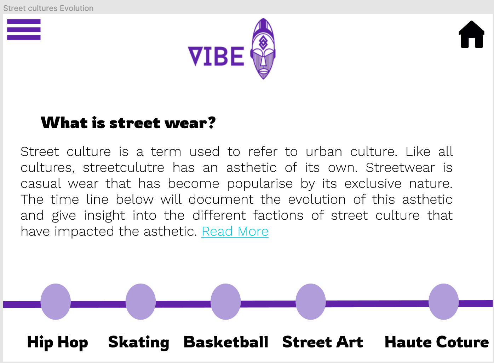

 
# What is my project about :question:
 
I decided to create a website for a fictitious street culture hub for creatives. Vibe Tribe is a hub for creatives to get together and collaborate as a collective to produce something wonderful as this is the essence of street culture. The name Vibe Tribe was chosen for this project as "vibe" is used to define the atmosphere of a space. In urban slang "vibe" is often used to describe something that is chilled, peaceful or someone who is great to be around. Whilst the word "Tribe" is most commonly used to refer to a social division of people within society linked by blood ties. However, it can also be used to refer to people who share cultural and/or social links. The latter is the definition being used in this case. As all users of this hub will identify as creatives and will influence and/or be influenced by street culture in some way.
 
# What inspired the Project ? :bulb:
 
The inspiration for this imaginary hub was the pandemic. There was as surge of creativity and togetherness which allowed people from various fields come together to solve problems, to challenge injustice & create amazing things in a way that has never happened before. It would be a shame to lose that as things slowly return to normal. Vibe Tribe is a means of maintaining that and encouraging people to come together and flourish, focusing on their common goals and interests as opposed to their differences. It also serves as a way to educate people about the contribution that street culture and its sub cultures have made to larger society.

 
:globe_with_meridians: [Vibe Tribe Live Website](https://bmcdonald2000.github.io/MS1-Vibe-Tribe/index.html)
 
 
# Table of contents :bookmark_tabs:
 [User Experience (UX)](#User-Experience-(UX)-art)
 
 [Current Features](#Current-features)
 
 [Testing](#Testing)
 
 [Technologies Used](#Technologies-Used)
 
 [Credits](#Credits)
 
# User Experience (UX) :art:
 
 ## User Stories
 
### Goals of a first time visitor :dart:
 
 • The visitor would want the purpose of the site to be clear and information should be easy to find.
 
 • The visitor would want the site to be easy to navigate on all devices.
 
 • The visitor would want the social media buttons to be easily accessible.
 
### Goals of a returning visitor :dart:
 
 • The visitor would be looking to find out more about street culture and be able to explore their interests more.

 • The visitor would be looking to find out more information about the hub

 • The visitor would would to feel like their niche is being recognised
 
 ### Goals of a frequent visitor :dart:
 • The visitor would want to sign up to get exclusive content and updates
 
 • The visitor would want to know what activities are scheduled for a specific day
 
 • The visitor would want to be able to navigate their way to specific content easily.
 
 ## Design
 
  ### Colour Scheme
 
  The main goal of this website is to provide a space for creatives to learn more about street culture, So I wanted to pick a colour scheme that linked to that. Purple and Gold are the colours for Lakers, a popular basketball team in the NBA and a lot of their apparel is popular within street culture.
 
  Purple is also said to symbolise creativity and transformation. This is the energy that I want the users to channel and associate with the hub. Gold is associated with luxury and wisdom. The site serves to educate those looking to learn more about street culture but also highlight the culture which has been developed by creatives and its transition from urban to luxury spaces.
 
  Below is the colour palette that I created, based on the message I wanted my colours to convey. I then used [cava's colour palette generator](https://www.canva.com/colors/color-palette-generator/) to make sure that the colours I had chosen worked with the site content. Where more contrast was needed between colours I have used white font or adjusted opacity. 

  (Media/colour-palette.png)

  The link colours were chosen based on contrast, as the main goal was to make these as accessible as possible for the users. After testing I changed the defult link colour to a dark red (#570000). Once clicked it will turn to dark blue (#1C1EA9) and be a very light blue (#05E9DD) on hover. I used [WebAIM](https://webaim.org/resources/contrastchecker/) to chose colours with high contrast ratio. These colours are shown below 

    
   
   
 
  ### Typography
 
  The font used for the headers, footers and buttons is a latin display typeface called 'Rowdies'. I have chosen this font as it is bold and creative, inline with the sites theme.
 
  
 
  The font used for the body text is a 'Work Sans', a typeface family based loosely on early Grotesques. It has simple features making it optimised for screen resolutions and easy for the user to read.
 
  
 
  ### Media :film_strip:
  I wanted the media used on my site to be a reflection of the creativity and interests of the users. I was unable to create my own content so I used royalty free images and videos.
 
  • My videos were from [Pexels](https://www.pexels.com/).
 
  • I used pictures from [Pexels](https://www.pexels.com/) and [unsplash](https://unsplash.com/).
 
  ###  Mockup
  I used figma to create my mockups and have included the links to the mobile and desktop mockups. There are a few differences in my mockup and the end product, so I have included  screenshots specific to those changes and the links to my mobile and desktop mockups are below:point_down:
 
  ### Desktop :desktop_computer:
  Initially I wanted to have a Hamburger side Menu as shown in the screenshots below. Later on I decided to use a navbar as this would be easy to navigate and would not draw attention away from the landing page video.
 
  I also changed the timeline to flip cards as I felt that this was more interactive and creative. :point_down:
 
   
  
  ### Mobile :iphone:
 
  To keep things as uniformed as possible I also changed the mobile menu to the nav bar and instead of flipcards I used hyperlinked pictures as a way to get more information on each niche. To view the mock ups please use the links. :point_down:
 
  [Mobile mockup](https://www.figma.com/file/sIg0LyQzM1Mp1HuRNO1qo6/Vibe-Tribe---mobile?node-id=0%3A1) :arrow_left:
 
  [Desktop mockups](https://www.figma.com/file/BbJR4T8QcH8Eg2WflvtA8f/Vibe-tribe-desktop?node-id=0%3A1) :arrow_left:
 
# Current Features
 
  ### Header
 
  • The header is the same across all pages and view port sizes, it contains the navigation bar with the active page being highlighted with a purple background and  gold font so that  it is easier for the user to navigate. On hover the page buttons turn purple and the font is gold as well. On smaller viewports the navigation bar displays vertically instead of horizontally.
 
  ### Logo
 
  • The logo is visible on every page irrespective of viewport size.
 
  ### Accessibility
 
  • All media used has a description in case the link breaks.
    
  • So those links are obvious to all users, I have changed the default active link and on hover link colours as the default colours did not create enough contrast with the site colours.
 
  ### Responsiveness
 
  • All pages are responsive up until 320px
 
  ### Footer
 
  • The footer is the same across all pages and viewports to keep it uniformed. This makes it easier to navigate the site as the user knows what to expect. The   social media icons are in the footer so that they are present on every page. I decided to make the footer black so that it was obvious to the reader and then made it transparent so that it did not detract from the nav bar.
 
## Page Specific Features :memo:
 
  ### Landing Page
 
  • I used a video background for the landing page on larger viewports that are muted and on autoloop. I did this as I felt it gave the user a feel for what the site is about. The chosen video captivates the Creative expression of street culture. For smaller viewports I have used an image which also provides the same message.
 
  ### Streetwears Evolution
 
  • To display the information I used flip cards on larger viewports. I felt this was a creative way for the user to engage with the site.
 
  • I used clickable images on smaller viewports that take you to the information relevant to each image.
 
  ### Come To The Hub
 
  • I styled the table header to purple and on hover the rows turn gold. This was so that there was consistent creative flare across the site. I wanted the user to feel as though every detail of their experience was important.
 
  ### Exclusives
 
  • I have created a signup form with validation so that the user is prompted if there is any error in completing the form.
 
  • I then linked the form to the code institute form dump so that the all user actions throughout the website generates a response.
 
# Future Features :rocket:
 
  • Add a review section, to make it easier to collect and implement user feedback.
 
  • Allow users to share their own stories on how they have contributed to streetwears evolution and/or have been impacted by it.
 
  • Use other programming languages to make the site more interactive and allow me to keep the same features across all viewports. I.e flipcards on smaller viewports is not possible with pure CSS.
 
  • Some images were not suitable for smaller viewports, so are not displayed. I would like to create/find similar images that are suitable for smaller screens, so that there is more consistency in the design across all view port sizes.
 
# Testing
 
## Testing user stories
 
### Goals of a first time visitor :white_check_mark:
 
 1. **The visitor would want the purpose of the site to be clear and information should be easy to find.**
 
     • The tagline of the logo is "for creatives" indicating to the visitor that this site is intended for creatives.
 
     • The landing page video also adds to the creative street culture vibe.
 
     • The navarbar is easily accessible in the header and gives the visitor the option to click the about us page where they can find more detailed information.
 
 2. **The visitor would want the site to be easy to navigate on all devices.**
 
     • All page links are directly accessible in the navigation bar. The navigation bar is present in the header of every page keeping consistency throughout the site so it is easy for the visitor to intuitively browse through the website.
 
     • All pages are responsive until 320px.
 
 3. **The visitor would want the social media buttons to be easily accessible.**
 
     • The social media icons are present in the footer on every page.
 
     • The links take you to the correct page
 
     • The icons are clearly visible in the footer
 
### Goals of a returning visitor :white_check_mark:
 
 1. **The visitor would be looking to find out more about street culture and be able to explore their interests more.**
 
     • The flip cards (larger screens) and clickable images (smaller screens) give the user the freedom to only explore the topics they are interested in.
 
     • if the reader wishes to find out more they can click the link that takes them to a page with further reading and links specific to the content discussed.
 
 2. **The visitor would be looking to find out more information about the hub**
 
     • There is a button in the navbar specific to the hubs details, this is available on every page.
 
 3. **The visitor would want to feel like their niche is being recognised**
 
     • The hub gives all creatives the chances to celebrate their niche with a space each day to do their own thing or the option to participate in a different activity each day.
    
     • The flip cards also document the contributions each niche has made.
 
### Goals of a frequent visitor :white_check_mark:
 1. **The visitor would want to sign up to get exclusive content and updates.**
 
     • There is a sign up form on the exclusives which will allow the user to get exclusive updates and content.
 
 2. **The visitor would want to know what activities are scheduled for a specific day.**
 
     • There is a table on the come to the hub page that documents this.
 
 3. **The visitor would want to be able to navigate their way to specific content easily.**
 
     • The nav bar has a button that takes you to all the main pages.
 
     • The read more hyperlinks take you to the pages with more information.
 
     • There is hyperlinked text throughout the website that will take you to the relevant pages.
 
     • Social media icons are on the bottom of every page.
 
## Validator testing
 
In order to ensure there was no syntax errors in my code I used a validator service.The results are shown below :point_down:
 
**HTML5** - There were no errors found
 
 **Main Pages:**
 
 • Landing page - [View W3C Markup validator results](https://validator.w3.org/nu/?doc=https%3A%2F%2Fbmcdonald2000.github.io%2FMS1-Vibe-Tribe%2Findex.html)
 
 • About us - [View W3C Markup validator results](https://validator.w3.org/nu/?doc=https%3A%2F%2Fbmcdonald2000.github.io%2FMS1-Vibe-Tribe%2Fabout-us.html)
 
 • Come to the Hub - [View W3C Markup validator results](https://validator.w3.org/nu/?doc=https%3A%2F%2Fbmcdonald2000.github.io%2FMS1-Vibe-Tribe%2Fcome-to-the-hub.html)
 
 • Streetwear's evolution - [View W3C Markup validator results](https://validator.w3.org/nu/?doc=https%3A%2F%2Fbmcdonald2000.github.io%2FMS1-Vibe-Tribe%2FStreetwear%27s-evolution.html)
 
 • Exclusives - [View W3C Markup validator results](https://validator.w3.org/nu/?doc=https%3A%2F%2Fbmcdonald2000.github.io%2FMS1-Vibe-Tribe%2FExclusives.html)
 
 **Information Pages:**
 
 • Basketball [View results](https://validator.w3.org/nu/?doc=https%3A%2F%2Fbmcdonald2000.github.io%2FMS1-Vibe-Tribe%2FInformation-pages%2FBasketball.html)
 
 • Hip-Hop - [View W3C Markup validator results](https://validator.w3.org/nu/?doc=https%3A%2F%2Fbmcdonald2000.github.io%2FMS1-Vibe-Tribe%2FInformation-pages%2FHip-Hop.html)
 
 • Street art - [View W3C Markup validator results](https://validator.w3.org/nu/?doc=https%3A%2F%2Fbmcdonald2000.github.io%2FMS1-Vibe-Tribe%2FInformation-pages%2FStreet-art.html)
 
 • Skating - [View W3C Markup validator results](https://validator.w3.org/nu/?doc=https%3A%2F%2Fbmcdonald2000.github.io%2FMS1-Vibe-Tribe%2FInformation-pages%2FSkating.html)
 
 • Haute Couture - [View W3C Markup validator results](https://validator.w3.org/nu/?doc=https%3A%2F%2Fbmcdonald2000.github.io%2FMS1-Vibe-Tribe%2FInformation-pages%2FHaute.Coture.html)
 
 • Japanese Streetwear - [View W3C Markup validator results](https://validator.w3.org/nu/?doc=https%3A%2F%2Fbmcdonald2000.github.io%2FMS1-Vibe-Tribe%2FInformation-pages%2FJapanese-Streetwear.html)
 
 
**CSS3** - There were no errors found
 
 • Landing page - [View W3C CSS validator results](https://jigsaw.w3.org/css-validator/validator?uri=https%3A%2F%2Fbmcdonald2000.github.io%2FMS1-Vibe-Tribe%2F&profile=css3svg&usermedium=all&warning=1&vextwarning=&lang=en)
 
 • About us - [View W3C CSS validator results](https://jigsaw.w3.org/css-validator/validator?uri=https%3A%2F%2Fbmcdonald2000.github.io%2FMS1-Vibe-Tribe%2Fabout-us&profile=css3svg&usermedium=all&warning=1&vextwarning=&lang=en#errors)
  • Come to the Hub - [View W3C CSS validator results](https://jigsaw.w3.org/css-validator/validator?uri=https%3A%2F%2Fbmcdonald2000.github.io%2FMS1-Vibe-Tribe%2Fcome-to-the-hub.html&profile=css3svg&usermedium=all&warning=1&vextwarning=&lang=en)
 
 • Streetwear's evolution - [View W3C CSS validator results](https://jigsaw.w3.org/css-validator/validator?uri=https%3A%2F%2Fbmcdonald2000.github.io%2FMS1-Vibe-Tribe%2FStreetwear%27s-evolution&profile=css3svg&usermedium=all&warning=1&vextwarning=&lang=en)
 
 • Exclusives - [View W3C CSS validator results](https://jigsaw.w3.org/css-validator/validator?uri=https%3A%2F%2Fbmcdonald2000.github.io%2FMS1-Vibe-Tribe%2FExclusives&profile=css3svg&usermedium=all&warning=1&vextwarning=&lang=en)
 
## Issues
 
 ### Errors
 • All known errors have been fixed

  ### Bugs
 • The auto close tags on VS Code caused some bugs, I was able to fix this by turning off auto close tags.
 
 • Close tags were also generated for inputs that had no close tags, this caused errors during validation that have now been fixed.
 
## Functionality Testing
 
 To ensure the functionality of my site I conducting testing on the following features prior to user testing:
 
 **Navbar:**
 
  • When the link is active or hovered on the navbar button is highlighted purple with gold font this was tested on all pages and on desktop and mobile. The active link always corresponds with the page.
 
  • All the links in the Navbar are working and have also been thoroughly tested.
 
  • The navar appears horizontally on screen sizes larger than 740px. On smaller screens the navbar displays horizontally. This is working as expected.
 
  • The navbar remains at the top of the page on all screen sizes
 
  • The navbar icons are visible on all pages and screen sizes.
 
 **Media:**
 
  • All other images used throughout the website show as expected. There are no broken links and all media is of good quality.
 
 **Links:**
 
  External:
 
  • All external links are working as expected.They take you to the correct external pages and the default link colours have been changed to ensure contrast. The links open in a new tab for the users convenience.
 
  Internal:
              
  • All internal links are working as expected.They take you to the relevant pages and the default colours of these links have been changed.
 
  • The links to the pages listed in the nav bar open in the same tab allowing seamless navigation through the site.
 
  • The links to the internal pages that provide extra information open in new tabs for the user convenience as these pages have no navigation bar and can only be accessed through the links in the streetwears evolution page.
 
 **Flip-cards:**
 
  • All flip cards flip on hover. However, because the project only uses CSS3 and HTML5 I was unable to make the flip cards responsive on mobile. For smaller screens there are clickable images instead. This is explained to the user in the text above the flipcards/images.
 
  •All hyperlinked text on the flipcards open the corresponding page in a new tab. All flip cards have been tested and work as expected on screens above 1100px.
 
  •All hyperlinked images open the corresponding page in a new tab. All images have been tested and work as expected on screens 1100px and below.
 
 **Video:**
 
  Landing page:
                
  •  The landing page video is auto looped and muted on larger screens, there are no issues.
 
  • The video on the exclusives page has clickable controls , which are visible on hover and work when pressed. However, the video has no attached audio.
 
  Exclusives page:
 
  • The video is only visible on larger screens.
 
 **Footer:**
        
  • The footer remains at the bottom and is visible on all pages and all devices.
 
  • I have added padding to the footer so the text and social media icons are never at the edge of the footer making it easy for the user to see.
 
  • The social media icons are visible on every page and when clicked open the relevant link in a new tap for the users convenience, this has been tested on all pages and a range of devices.
 
## Compatibility Testing
 
 
 | Browser| Safari| Opera | Microsoft Edge| Chrome | Firefox| Internet Explorer|
 |--------| ------| ----- | ------------- | -------| -------| -----------------|
 |Mobile  |:white_check_mark:|:white_check_mark:|:white_check_mark:|:white_check_mark:|:white_check_mark:|    Not tested    |
 |Tablet  |:white_check_mark:|:white_check_mark:|:white_check_mark:|:white_check_mark:|:white_check_mark:|    Not tested    |
 |Desktop |:white_check_mark:|:white_check_mark:|:white_check_mark:|:white_check_mark:|:white_check_mark:|    Not tested    |
 
 
 • OS compatibility was tested on iOS 14.8, Android 11, ipadOS 15, Windows 10 and MacOS BigSur.
 
 • The devices used include but are not exclusive to Macbook Pro, iphone XR, HTC 11, iphone 11Pro and iPad air. To ensure the website was thoroughly tested I used [Chrome Dev Tools](https://developer.chrome.com/docs/devtools/) to test on a range of viewports from 320px up to 2560px.
 
## Usability Testing :bust_in_silhouette:
 
 • I shared the website with family and friends of varying ages and computing skills to test the ease of navigation on a variety of devices. There were no issues with navigation.
 
 • I also used testers to check that all buttons were working and there were no broken links. A few broken links were found but the issues have been corrected. After corrections were made I asked for them to be tested again and everything was working as expected.
 
## Performance Testing
 
 To ensure performance was tested extensively I used two tools:
 
  ### **Lighthouse Testing**
 
  I used [lighthouse testing](https://developers.google.com/web/tools/lighthouse)to test the performance of my website, the results are shown below.:point_down:
 
 ### **Main pages:**

  **•Landing page**
 
  
 
  **•About us page**
 
  
 
  **•Streetwear's Evolution page**

  

  **•Come to the hub page**
 
  
 
  **•Exclusives page**
 
  

 ### **Information Pages:**
 
 **• Basketball** 

  

 **• Hip-Hop**

  

 **• Street art**

  

 **• Skating**

  

 **• Haute Couture**

  

 **• Japanese Streetwear**

  

  Overall the webpage lighthouse testing was successful, passing every category scoring at least 90% in each category.
 
  ## Webpagetest
 
  I used [webpagetest](https://www.webpagetest.org/) to test my performance on a range of devices, the results below show the site performance on a google pixel XL emulator. :point_down:
 
  All of my results came back as: 
 
  • Landing page [view result](https://www.webpagetest.org/result/210926_BiDcM4_7875a4df4fe3696aa031870f1ef97bab/)
 
  • About us page [view result](https://www.webpagetest.org/result/210926_AiDc69_43343a2d8d99ac972d83f61fb6c7e616/)
 
  • Streetwear's Evolution page [view result](https://www.webpagetest.org/result/210926_BiDcKG_76acead2a3b3093f9538608abfafc706/)
 
  • Come to the hub page [view result](https://www.webpagetest.org/result/210926_BiDc9E_668ce67d794fb8aabc96dbf309dd82ba/)
 
  • Exclusives page [view result](https://www.webpagetest.org/result/210926_AiDcC4_cecb628b55c1f1d9a0f27171995b4760/)
 
  **Information pages**
 
  • Basketball [view result](https://www.webpagetest.org/result/210926_AiDcH3_2f625d9e6e9aaf8f0384e36fd5006269/)
  • Hip-Hop [view result](https://www.webpagetest.org/result/210926_BiDc4V_00d7f7446bce16e2dd1c5c6af3cc3358/)
  • Skating [view result](https://www.webpagetest.org/result/210926_BiDcAM_dc4864630c0367fe27955f6e195c45e7/)
  • Street-art [view result](https://www.webpagetest.org/result/210926_BiDc8V_b600a7a5eb55cf29bdbce4a08dfa0c34/)
  • Haute Couture [view result](https://www.webpagetest.org/result/210926_BiDcQZ_f6a00b5a23a91fba1ebee069d9c7dc29/)
  • Japanese Streetwear [view result](https://www.webpagetest.org/result/210926_BiDcMW_c921ce166d5e4c6ae34d7e4f7122512b/)
 
  The project failed security and cache static content, but these are beyond the remits of this project so wont be included. Overall the website scored A for performance, but I will look to improve my security score and static cache content in the future.
 
# Technologies Used
 
  ## Languages Used
 
  
  
 
  ## Programs Used
 
  [Tailor brands](https://www.tailorbrands.com/) - I used Tailor brands to create my logo
 
  [Font Awesome](https://fontawesome.com/) - I used Fontawesome to add social media icons and the icons in the nav bar.
 
  [Google Fonts](https://fonts.google.com/) - The fonts used are google fonts
 
  [Gitpod](https://www.gitpod.io/blog/next-chapter-for-gitpod) - Gitpod is powered by VS Code, storing my code in the cloud. I can then commit that code to my Github repository as Gitpod and Github are connected.
 
  [Optimizilla](https://imagecompressor.com/) - I used Optimizilla to compress my images as smaller files would reduce the download size making it more accessible for all users.
 
  [Free convert](https://www.freeconvert.com/video-compressor) - I used free convert to compress my videos as smaller files would reduce the download size making it more accessible for all users.
 
  [Canva](https://www.canva.com/) - I used canva to create my colour palette. I also used Canva to remove the background colour of my logo and the Spiral image on the about us page.
 
  [Figma](https://www.figma.com/) - I used figma to design my mockups.
 
  [Git](https://git-scm.com/) - I used Git to track the changes to my code. Git was also used for version control.
 
  [Github](https://github.com/) - Github was used to host my project files. I then used Gitpages to deploy the website.
 
  [Vs Code](https://code.visualstudio.com/) - VS Code powers gitpod and was used to build the website.
 
  [Slack](https://slack.com/intl/en-gb/) - I used slack to get feedback on my project
 
  [WebAIM](https://webaim.org/resources/contrastchecker/) - I used WebAIM to help improve the contrast ratio of my links
 
  [Webpagetest](https://www.webpagetest.org/) - I used Webpagetest to test the performance of the websiteon a range of devices.
 
  [lighthouse testing](https://developers.google.com/web/tools/lighthouse) - I used lighthouse testing to test the performance of the website.

  [Amiresponsive?](http://ami.responsivedesign.is/) - I used this site to create the image used at the start of my README.
 
  
  
  
  
  
  
 
# Deployment

**Publishing**

I used [GitHub Pages](https://pages.github.com/) to publish this webiste. In order for the site to be deployed correctly, ensure your landing page is named index.html. 

I used the following steps to deploy this site:

1. Log in to Github and locate the [Github Repository](https://github.com/)

2. Click the "settings" button.

3. Scroll down until you see "GitHub Pages".

4. In the source dropdown select "master branch".

5. Once the page refreshes the link to your publish page will be 
displayed under GitHub pages.

6. The link colour will change to green, it can take a few moments for the site to be published. 

**Making a Local Clone**

1. Go to the [Vibe Tribe repository](https://github.com/bmcdonald2000/MS1-Vibe-Tribe)

2. Click the "Clone or Download" button under the repository name.

3. A button will appear called Clone with HTTPS.

4. Copy this clone URL for the Vibe Tribe repository

5. Open Git Bash in your local IDE

6. Change the current working directory to the location where you want the clone directory to be made

7. Type `git clone`, then paste the URL you copied earlier (from step 4) This should look like `git clone https://github.co./YOUR-USERNAME/YOUR-REPOSITORY`

8. Press enter. Your local clone will be created. If you have any issues or want to read more [click here.](https://docs.github.com/en/repositories/creating-and-managing-repositories/cloning-a-repository#troubleshooting-cloning-errors)
 
 
# Credits :open_book:
 
## Code :computer:
 
  • All code was written by Brieanna McDonald (the author).
 
  • I used tutorials on [w3schools](https://www.w3schools.com/) to help create my nav bar and flip cards
 
## To write my README I used :spiral_notepad:
 
  • [Code Institute sample README](https://github.com/Code-Institute-Solutions/SampleREADME)
 
  • [Code Institute Template README](https://github.com/Code-Institute-Solutions/SampleREADME)
 
  • [Markdown Cheatsheet](https://github.com/adam-p/markdown-here/wiki/Markdown-Cheatsheet)
 
  • [Emoji Cheat Sheet](https://github.com/ikatyang/emoji-cheat-sheet/blob/master/README.md) to add emojis in my README.
 
  • [Markdown badges](https://github.com/Ileriayo/markdown-badges#social) to add badges in my README.
 
## Acknowledgements
 
  • Thank you to my mentor for answering my questions and always giving me useful feedback and insights.
  

